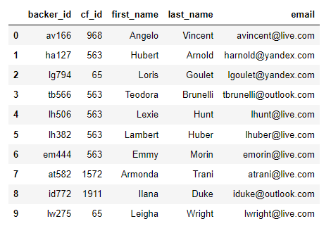
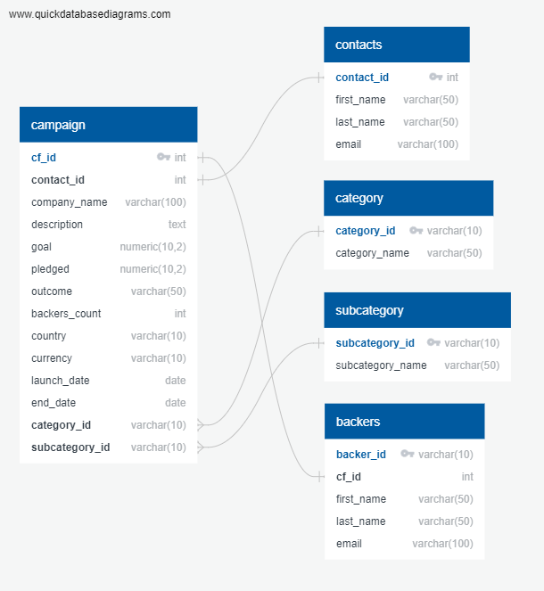

# Independent Funding - Crowdfunding ETL

## Project Overview

Independent Funding is a crowdfunding platform aimed to raise funding for independent projects or ventures. Britta, a junior SQL developer for the company, seeks our assistance in migrating all of Independent Funding's accessible data from one large Excel file onto a PostgreSQL database.

We've been tasked with the following:

- Extracting and transforming the data from the large Excel file into four separate CSV files
- Creating a PostgreSQL database and tables by using an ERD
- Loading the CSV files into the database
- Performing SQL queries to generate reports for stakeholders

 

## Overview of Deliverables
We created four different CSV files (campaign, category, subcategory, contacts) from a crowdfunding Excel file and uploaded the files into separate tables in a SQL database.

We used regular expressions to clean the data and extract information into multiple columns

 
Next, we created 2 new columns (first_name and last_name) to divide the 'name' column and drop it

 
In the 3rd deliverable, we created a crowdfunding relationship diagram to map our database structure before creating our tables nad importing data into PgAdmin.

 

Lastly, we created 2 new queries to find the remaining goal amount for all live projects based on the contacts table and the remaining campaign goal amount from the backers table on all crowdfunding campaigns.

 

## Summary & Conclusion

For deliverable 4 (bonus), we determined there were 14 live campaigns with a remaining goal amount.

All data was successfully extracted, transformed, and loaded onto a PostgreSQL database. The data was split into all required columns and the Entity Relationship Diagram provided a helpful overview to stay on path and provide accurate constraints for primary and foregin keys in PostgreSQL.